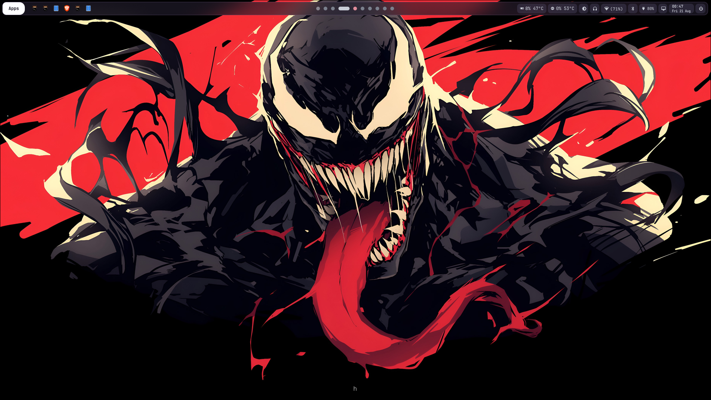
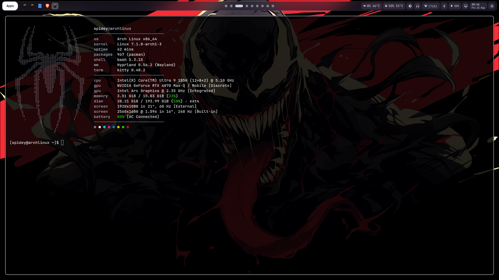
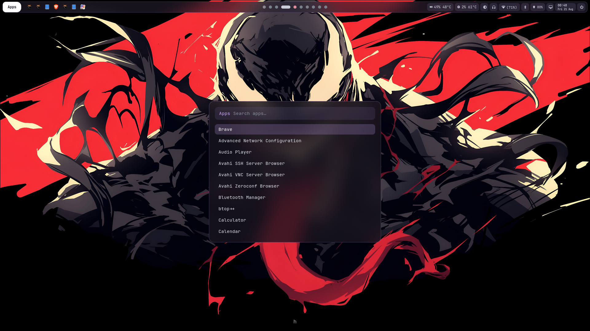
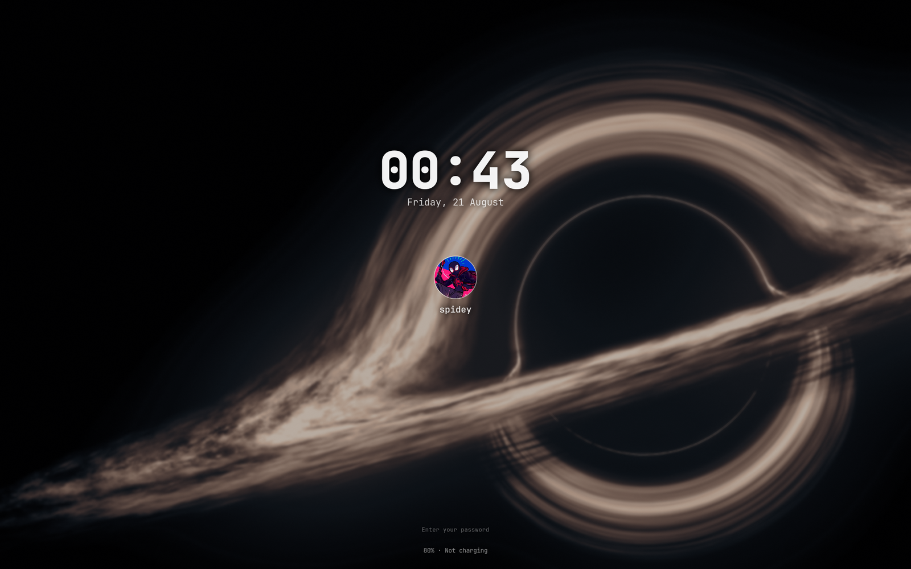
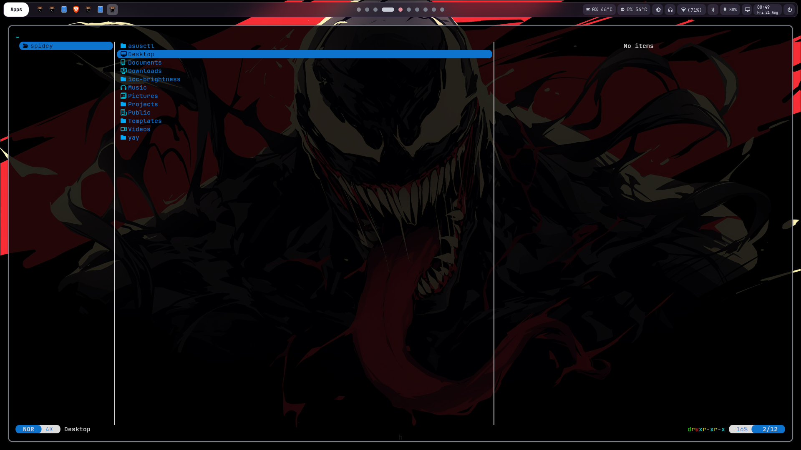
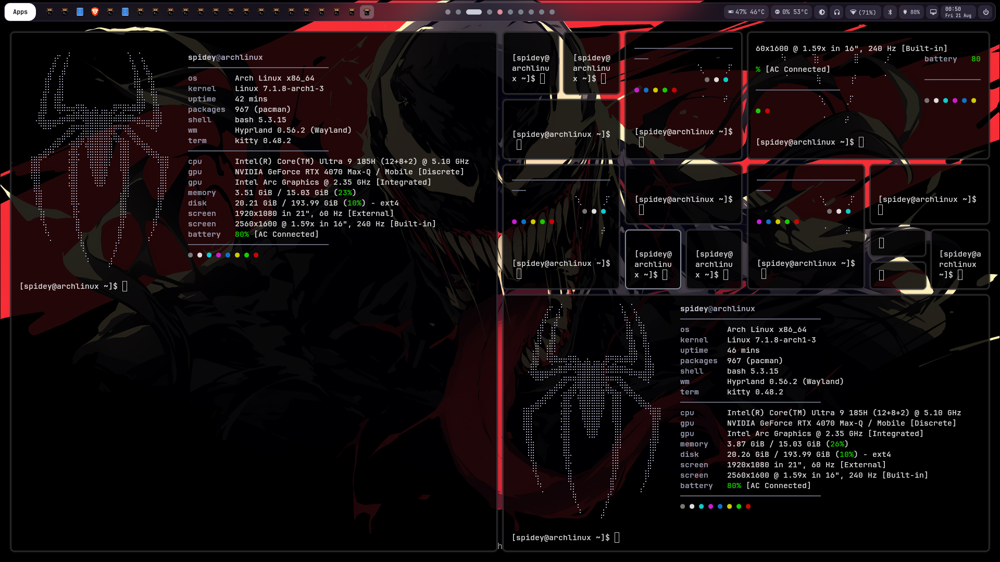

# dotfiles

Hyprland desktop for an **ASUS ROG Zephyrus G16 (GU605)** running Arch Linux.
Violet-on-glass theme across the bar, launcher, notifications and lock screen.

```
  Compositor   Hyprland 0.56 (Lua config)
  Bar          Waybar          Launcher   Rofi
  Notifs       SwayNC          Lock       Hyprlock
  Wallpaper    Hyprpaper       Idle       Hypridle
  Terminal     Kitty           Shell      Bash
```

---

## Gallery

|                Desktop                 |                 Fastfetch                  |                 Launcher                 |
| :------------------------------------: | :----------------------------------------: | :--------------------------------------: |
|     |     |     |

|              Lock screen               |                    Yazi                    |                Terminals                 |
| :------------------------------------: | :----------------------------------------: | :--------------------------------------: |
|  |           |   |

### Bar

Launcher and running apps on the left, workspace dots in the centre, system
status on the right — GPU, CPU, brightness, volume, network, Bluetooth,
battery, ROG control, tray, clock and power.


---

## Install

```bash
git clone https://github.com/SafalNarshing/dotfiles ~/Projects/dotfiles
cd ~/Projects/dotfiles && ./install.sh
```

`install.sh` backs up anything already in place to `*.bak` before linking, so
it is safe to re-run.

---

## Keybindings

`SUPER` is the Windows key.

### Launching

| Keys | Action |
| --- | --- |
| `SUPER` `Q` | Terminal (kitty) |
| `SUPER` `R` | App launcher (rofi) |
| `SUPER` alone | App launcher — release-bind |
| `SUPER` `E` | File manager (nautilus) |
| `SUPER` `SHIFT` `E` | Terminal file manager (yazi) |
| `SUPER` `SHIFT` `M` | Monitor config TUI (hyprmoncfg) |
| `SUPER` `C` | Close window |

### Workspaces

| Keys | Action |
| --- | --- |
| `SUPER` `1`–`0` | Go to workspace |
| `SUPER` `SHIFT` `1`–`0` | Move window to workspace |
| `SUPER` `CTRL` `←` `→` | Previous / next existing workspace |
| `SUPER` `CTRL` `↑` | Next empty workspace — "new desktop" |
| `SUPER` `CTRL` `SHIFT` `←` `→` | Carry window to neighbouring workspace |
| `SUPER` scroll | Cycle workspaces |
| `SUPER` `S` | Toggle scratchpad |
| `SUPER` `ALT` `S` | Move window to scratchpad |

### Windows

| Keys | Action |
| --- | --- |
| `SUPER` `←` `→` `↑` `↓` | Focus by direction |
| `SUPER` `V` | Toggle floating |
| `SUPER` `P` | Pseudo-tile |
| `SUPER` `J` | Toggle split direction |
| `SUPER` + drag LMB / RMB | Move / resize |

### Session

| Keys | Action |
| --- | --- |
| `SUPER` `L` | Lock now |
| `SUPER` `ESC` | Power menu |
| `SUPER` `M` | Exit Hyprland |
| Lid close | Lock |

### Capture & clipboard

| Keys | Action |
| --- | --- |
| `SUPER` `SHIFT` `S` | Region screenshot → clipboard |
| `SUPER` `SHIFT` `V` | Clipboard history |

### Media

| Keys | Action |
| --- | --- |
| `XF86MonBrightness` `↑` `↓` | Brightness |
| `XF86Audio` `Raise` `Lower` `Mute` | Volume |
| `XF86Audio` `Play` `Next` `Prev` | Playback |

---

## Packages

### Core desktop

| Package | Purpose |
| --- | --- |
| `hyprland` | Wayland compositor. Uses the **Lua** config format |
| `waybar` | Status bar |
| `rofi-wayland` | App launcher and power menu |
| `swaync` | Notification daemon **and** notification centre |
| `hyprpaper` | Wallpaper daemon |
| `hyprlock` | Lock screen |
| `hypridle` | Idle timeouts, lock on lid close |
| `kitty` | Terminal, GPU-accelerated |
| `xdg-desktop-portal-hyprland` | Screen sharing and screenshot portal |
| `hyprpolkitagent` | Polkit authentication prompts |

### Utilities

| Package | Purpose |
| --- | --- |
| `grim` + `slurp` | Screenshot capture and region selection |
| `wl-clipboard` | `wl-copy` / `wl-paste` |
| `cliphist` | Clipboard history store |
| `wl-gammarelay-rs` | Brightness via gamma ramps — the panel is OLED |
| `playerctl` | Media key handling |
| `pavucontrol` | Audio mixer |
| `blueman` + `bluez-utils` | Bluetooth |
| `nautilus` | Graphical file manager |
| `yazi` | Terminal file manager |
| `btop` | System monitor |
| `fastfetch` | Shell greeter |
| `network-manager-applet` | Provides `nm-connection-editor` |

### Hardware

| Package | Purpose |
| --- | --- |
| `nvidia-open` + `nvidia-utils` | RTX 4070 driver — versions must match |
| `intel-media-driver` | Video decode on the Intel iGPU |
| `asusctl` | Fan curves, battery charge limit, Aura |
| `rog-control-center` | ASUS GUI control panel |

### Fonts

| Package | Purpose |
| --- | --- |
| `ttf-jetbrains-mono-nerd` | UI and terminal font, supplies all glyph icons |
| `ttf-nerd-fonts-symbols` | Icon fallback |

---

## Layout

```
.config/hypr/          hyprland.lua, hyprlock, hypridle, hyprpaper, scripts/
.config/waybar/        config.jsonc, style.css, scripts/
.config/rofi/          launcher + power menu themes and script
.config/swaync/        notification centre config and CSS
.config/kitty/         terminal
.config/fastfetch/     greeter + spider ASCII logo
.config/xdg-desktop-portal/
Pictures/Wallpapers/   wallpapers, avatar
screenshots/           gallery images
.bashrc                greeter guard, yazi `y` wrapper
```
